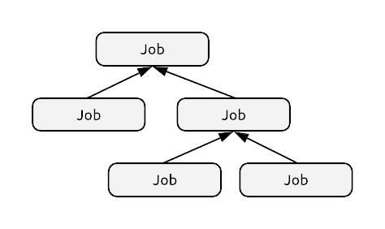
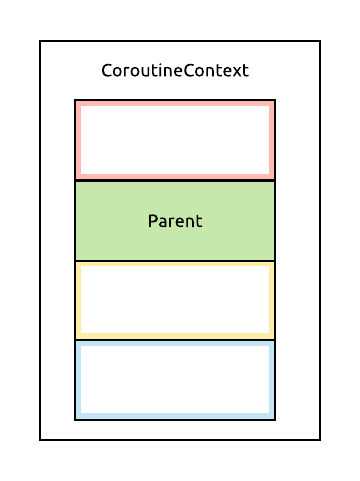
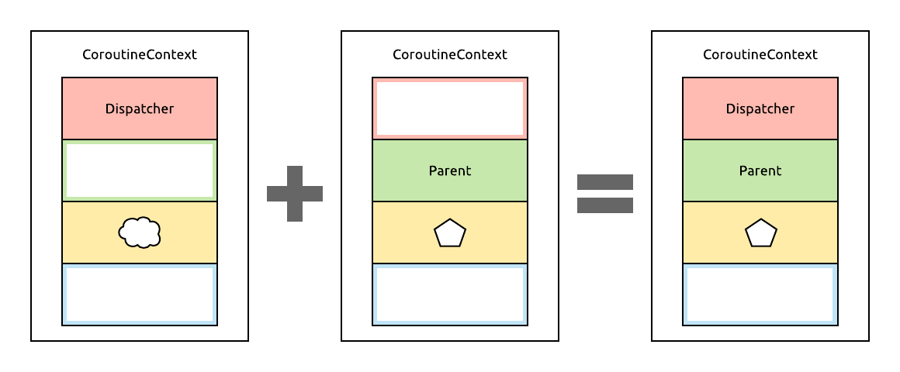

# Coroutine scopes

We deliberately omitted an important part of coroutines earlier: these are coroutine scopes. We'll simplify them even now, because we don't have time to fully cover them, but we'll see how they're useful for us. If you want to read up on them later, [this article](https://medium.com/@elizarov/structured-concurrency-722d765aa952) by Roman Elizarov is the definitive explanation.

For us, coroutine scopes are going to be all about *cancellation*. When we create a new coroutine with `launch`, it runs off to do its work on whatever dispatcher we assigned it to, and it may run for a very long time.

## Where do we start?

Concentrating on Android, launching coroutines in our `Activity` doesn't seem like a good idea, since they'll be recreated on configuration changes. For the example of a network call, this would mean that rotating the device would reload the data on the current screen. However, launching them from a `ViewModel` sounds enticing. They survive the configuration changes we fear, and therefore they could keep the references to our coroutines for cancellation purposes, as well as store their results when they complete - any newly created `Activity` can then get the results from the `ViewModel` and display it.

## Cancellation, jobs and parenting

What would this look like in code, and how exactly do we "keep references to coroutines" or cancel them?

Whenever we use `launch`, it returns a `Job` instance. This `Job` represents the running coroutine, and we can perform a couple operations on it - its interface is actually quite similar to what `Thread` provides. We can check if a coroutine is still active, wait for it to complete in a suspending manner, and most notably, it has a `cancel` method. 

> Cancelling a coroutine is essentially just setting a flag somewhere, and this has to be handled inside the coroutine, it doesn't just forcibly terminate it. Built-in suspending constructs usually support this already, and there's a way for us to check for cancellation in our own suspending functions as well (look [here](https://github.com/Kotlin/kotlinx.coroutines/blob/master/docs/cancellation-and-timeouts.md#cancellation-is-cooperative) for details on how this can be done).

Okay, let's really start looking at some code now! An obvious thing to do would be to keep each `Job` we start in a `List` in the `ViewModel`, and cancel them all when the `ViewModel` is destroyed:

```kotlin
class UserViewModel : ViewModel() {

    private val jobs = mutableListOf<Job>()

    fun getUserProfile() {
        jobs += launch {
            // fetch profile from somewhere, put them in a LiveData
        }
    }

    fun getUserFriends() {
        jobs += launch {
            // fetch friends from somewhere, put them in a LiveData
        }
    }

    override fun onCleared() {
        jobs.forEach { it.cancel() }
    }

}
```

This is a bit tedious to manage. If you've used Rx before, you've probably seen the `CompositeDisposable` class that can contain a number of `Disposable`s, and dispose them all simply. We can do something similar here, by making use of the fact that a coroutine can have a *parent*. These parent-child relationships organize coroutines in a tree structure. When a coroutine's parent is cancelled, all of its children will be cancelled too.



Setting a parent happens to work the same way as setting a dispatcher - a coroutine's parent is just another element of its `CoroutineContext`.



```kotlin
val parentJob = launch { ... }
val child1 = launch(parentJob) { ... }
val child2 = launch(parentJob) { ... }

parentJob.cancel() // Cancels all 3 coroutines
```

If we also want to set the dispatcher for a coroutine, we'd need to pass two `CoroutineContext` objects to the coroutine builder. We can't pass in multiple contexts, but we can combine them into a single new one. This operation merges the elements in the two contexts, and in the case that both contexts define the same element, the element from the context on the right will be used in the result.



In code, this would look like this, using the `+` operator:

```kotlin
val parentJob = launch { ... }
val child = launch(parentJob + Contexts.UI) { ... }
```

The second coroutine here will be the child of the first one (and be cancelled if that one is cancelled), and it will run in the UI context we've defined.

With these updates, our `ViewModel` could now look like this - notice the trick of creating an empty `Job` which doesn't actually run any code, but just acts as a parent for all others:

```kotlin
class UserViewModel : ViewModel() {

    private val parentJob = Job()

    fun getUserProfile() {
        launch(Contexts.UI + parentJob) {
            // fetch profile from somewhere, put them in a LiveData
        }
    }

    fun getUserFriends() {
        launch(Contexts.UI + parentJob) {
            // fetch friends from somewhere, put them in a LiveData
        }
    }

    override fun onCleared() {
        parentJob.cancel()
    }

}
```

## CoroutineScope

Since this pattern of confining coroutines to a certain component's lifetime in an application was so common, it's now explicitly enforced via `CoroutineScope`. All usages of `launch` we've seen until now are actually deprecated. What we are supposed to do instead is use `CoroutineScope.launch`, which is the same method, only defined as an extension on the `CoroutineScope` interface.

This interface is very simple: it just requires us to define a `CoroutineContext` that any coroutine launched within this scope should use, and this is exactly what we've been doing so far in a less convenient manner. Let's make our `ViewModel` a `CoroutineScope`!

```kotlin
class UserViewModel : ViewModel(), CoroutineScope {

    private val parentJob = Job()

    override val coroutineContext: CoroutineContext = Contexts.UI + parentJob 

    fun getUserProfile() {
        launch {
            // fetch profile from somewhere, put them in a LiveData
        }
    }

    fun getUserFriends() {
        launch {
            // fetch friends from somewhere, put them in a LiveData
        }
    }

    override fun onCleared() {
        parentJob.cancel()
    }

}
```

Now, our combined `CoroutineContext` is only defined in a single place, and every `launch` call inside this `CoroutineScope` will use that context automatically! 

## Notes

There are additional benefits to using `CoroutineScope` which eliminate certain common bugs when nesting coroutines. We'll skip these for now, as we won't be using them in our later examples. But again, I recommend reading more about structured concurrency [here](https://medium.com/@elizarov/structured-concurrency-722d765aa952), as well as watching [this talk](https://youtu.be/P7ov_r1JZ1g) from KotlinConf 2018 by Chris Banes.

## Continue...

[We're done with the theory! Back to the main page.](../../README.md#the-architecture)
