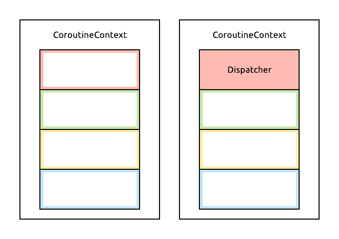

# Coroutines

Coroutines are Kotlin's language level solution to concurrency and asynchronous programming. We'll be taking a look at a tiny vertical slice of what they offer, focusing on a specific use case where they can help us during Android development. Just know that coroutines are capable of much more and can be used in many more ways than shown here.

##  Starting point

We'll be looking at a made up example of network calls, specifically, we'll start with a callback-based interface which you're probably familiar with from using libraries such as Retrofit. Here's what we'll be working with:

```java
interface CallbackUserApi {

    @FunctionalInterface
    interface Callback<T> {
        void onResult(T result);
    }

    void getUsers(Callback<List<User>> callback);

}
```

We can assume that the implementation of this interface will make the network call on a background thread, and then invoke the callback on the main thread of the application.

Calling this from Java should be familiar, we'll create an anonymous callback to process the result - in this case, we'll print each name back on the UI thread:

```java
api.getUsers(new CallbackUserApi.Callback<List<User>>() {
    @Override
    public void onResult(List<User> result) {
        for (User user : result) {
            System.out.println(user.getName());
        }
    }
});
```

The same API can be used very similarly from Kotlin, where we can also pass a lambda as the callback (which we could've also done with Java 8 of course).

```kotlin
api.getUsers { users ->
    for (user in users) {
        println(user.name)
    }
}
```

## Our first coroutine

To get started with coroutines, let's take a different implementation of this API, one that has simple blocking methods instead of callbacks. (This interface is in Kotlin, but that makes no difference.)

```kotlin
interface BlockingUserApi {
    fun getUsers(): List<User>
}
```

Let's write our first coroutine and make a call to this API. Coroutines can be created with *coroutine builders*, one of which is the `launch` function. This function starts a new coroutine, and runs the code passed to it as a lambda in that coroutine.

```kotlin
launch {
    val users = api.getUsers()
    for (user in users) {
        println(user.name)
    }
}
```

`launch`, by default, will run its coroutine on a threadpool, which means that the blocking API call will block a background thread, but then our printing of names will also happen on this background thread. What we'd actually want is to use this result on the UI thread - we'll see how to do it in a moment.

Another important note is that `launch` doesn't block the thread that it's called in - if we were to add code after calling `launch`, that code would (almost certainly) run before the coroutine inside `launch` is executed:

```kotlin
launch {
    println("Second, probably")
}

println("First!")
```

This very simple usage of `launch` is analogous with this `Thread` creation, except `launch` only creates a lightweight coroutine that's executed on an already existing thread from a threadpool:

```kotlin
Thread {
    println("Second, probably")
}.start()

println("First!")
```

## Context

`CoroutineContext`s are a way to describe _how_ a coroutine should be executed. They are made up of multiple distinct elements, and each `CoroutineContext`s may or may not contain each of these elements. 

You can think of `CoroutineContext`s as having various "slots" that may or may not have a value in them (an empty "slot" will fall back on some defaults):



We're only concerned with one of these for now: the `Dispatcher` to use to execute the coroutine, i.e. what thread(s) to run the coroutine on.

The `kotlinx-coroutines` library we're using provides some default `Dispatcher` implementations we can choose from, and it's also quite easy to create our own using the factory functions it provides. These are `CoroutineContext`s themselves, which only contains a single element, the `Dispatcher`.

Let's group our contexts in an `object` so we can access them easily:

```kotlin
object Contexts {
    val UI = Dispatchers.Main
    val IO = Executors.newFixedThreadPool(4).asCoroutineDispatcher()
}
```

For the main thread, we'll use a `Dispatcher` from the `kotlinx-coroutines-android` library, which wraps the Android main thread's `Looper` in a `CoroutineContext`. For our IO tasks, we're using a thread pool with a fixed thread count of 4, to show how we may create our very own threadpools and turn them into `Dispatcher`s. (In a real application, we might also just use the built-in `Dispatchers.IO` for this use case.)

Now that we have these contexts to run coroutines in, let's get back to calling our API. We can tell `launch` to use the UI context easily enough, as it takes a context as its optional first parameter. This makes the code passed to `launch` execute on the UI thread, but we need to place the network call in the IO context, and this is where our second coroutine related function, `withContext` comes in. This is a helper method which changes the context that our current coroutine is running in, and runs the code it wraps around in a new context. 

```kotlin
launch(Contexts.UI) {
    println("I'm on the UI thread!")
  
    val users = withContext(Contexts.IO) {
        api.getUsers()
    }

    for (user in users) {
        println(user.name)
    }
}
```

When this code hits the `withContext` call, the coroutine will be *suspended* on the UI thread,. It will let the UI thread go, leaving it free to process UI events, etc. At the same time, the coroutine continues running the code passed to `withContext` in the IO context, on our 4-thread threadpool.

When the network call inside `withContext` returns, `withContext` will return its result, and our coroutine will continue its execution once again on the UI thread, right where it left off, now making use of the result of the network call. Going back and forth between threads is that simple and seamless.

This suspension mechanism and relatively easy jumping between different `CoroutineContext`s is the key strength of coroutines.

Let's look at this example another way, just to practice how these functions work. We could also "invert" the way we use these contexts, so to speak. We could `launch` the initial coroutine on the IO thread, execute our blocking call there, and then move the code where we use its result to the UI context, like so:

```kotlin
launch(Contexts.IO) {
    val users = api.getUsers()

    withContext(Contexts.UI) {
        for (user in users) {
            println(user.name)
        }
    }
}
```

## Nested behaviour

Next, we'll update the interface we're using to access the API, with the ability to get the nameday of each user (this is going to be just a `String` as well).

```java
interface CallbackUserApi {

    @FunctionalInterface
    interface Callback<T> {
        void onResult(T result);
    }

    void getUsers(Callback<List<User>> callback);

    void getNameDay(String name, Callback<String> callback);

}
```

If we wanted to first get the list of users, then all of their namedays, in Java, we'd do something like this:

```java
api.getUsers(new CallbackUserApi.Callback<List<User>>() {
    @Override
    public void onResult(List<User> result) {
        for (User user : result) {
            api.getNameDay(user.getName(), new CallbackUserApi.Callback<String>() {
                @Override
                public void onResult(String result) {
                    System.out.println(result);
                }
            });
        }
    }
});
```

This is _okay_ to write, but certainly not very pleasant to read later.

This code of course can be made nicer with lambdas, in either Java or Kotlin:

```kotlin
api.getUsers { users ->
    for (user in users) {
        api.getNameDay(user.name) { nameday ->
            println(nameday)
        }
    }
}
```

But this is still continually increasing indentation in our source code, and these callbacks are hard to reason about, synchronize, or coordinate in any way.

Question is, how would we make these same calls with coroutines? We could do the following, using a blocking version of the API again for these coroutine examples:

```kotlin
launch(Contexts.UI) {
    val users = withContext(Contexts.IO) { api.getUsers() }
    for (user in users) {
        launch(Contexts.UI) {
            val nameday = withContext(Contexts.IO) { api.getNameDay(user.name) }
            println(nameday)
        }
    }
}
```

This code is equivalent to the versions using callbacks, in that:
- `for` loop runs on the UI thread,
- `println` calls are on the UI thread,
- network calls are done on background threads (although we're more explicit about which background threads to use, by providing our own pool),
- background calls run in parallel, and may execute and print their results in any order.

Coroutines work fine here, but they aren't at their best, because they are _sequential_ by default instead of _parallel_. This is a very conscious design choice by the creators of coroutines. While we do need asynchronous code in our programs, we're usually better off if they work sequentially, as we're more used to sequential code, and it's generally easier to reason about.

Performing this task sequentially would mean that we'd first get the list of users, then fire off the nameday network call for the first one, wait for its result, print it, and only then make the same call for the second user, and so on. This would be difficult enough to do in Java safely that we won't even cover that here.

However, with coroutines, this is actually the simpler thing to do. If we don't `launch` coroutines for each user, but instead just perform API calls in the `for` loop using `withContext`, each network call will suspend the loop, be performed on the IO threadpool, and then continue the loop on the UI thread, right from where it left off:

```kotlin
launch(Contexts.UI) {
    val users = withContext(Contexts.IO) { api.getUsers() }
    for (user in users) {
        val nameday = withContext(Contexts.IO) { api.getNameDay(user.name) }
        println(nameday)
    }
}
```

Notice that the code for this only differs slightly from the code we'd use if these were all synchronous calls. We don't have to manage callbacks, create data structures to keep track of where we are in the execution of our code, or anything of the sorts - we can just use a regular for loop and make asynchronous calls inside it.

This can be made even nicer if we use a version of the API interface that's designed to be consumed by coroutines, namely one that has its methods marked with `suspend`. This single keyword is actually the only coroutine related addition to the language and it enables everything they can do - all other functionality is implemented on top of the basic suspension mechanism as library functions.

A suspending function (one marked with `suspend`) may suspend its execution on the current thread, just like `withContext` does. For this reason, these functions can only be called from coroutines. Here's what an implementation of a suspending network API could look like, reusing the blocking API for now:

```kotlin
class CoroutineUserApi(private val blockingApi: BlockingUserApi) {
    
    suspend fun getUsers(): List<User> = withContext(Contexts.IO) {
        blockingApi.getUsers()
    }

    suspend fun getNameDay(name: String): String = withContext(Contexts.IO) {
        blockingApi.getNameDay(name)
    }

}
```

Making use of suspending functions, this class already handles threading internally: every call made to it will be moved to the IO context and performed there.

This simplifies the usage of the API to this code:

```kotlin
launch(Contexts.UI) {
    val users = api.getUsers()
    for (user in users) {
        val nameday = api.getNameDay(user.name)
        println(nameday)
    }
}
```

At this point, we've essentially made the asynchronous nature of these API calls transparent to our client code. After launching the initial coroutine, we are using `getUsers` and `getNameDay` as if they were regular, synchronous, blocking method calls.

## Notes

This really was just a brief intro to coroutines. If you want to look into them more, I suggest [this article](https://kotlinexpertise.com/kotlin-coroutines-guide/) for an intermediate look, [this one](https://proandroiddev.com/demystifying-coroutinecontext-1ce5b68407ad) to learn more about `CoroutineContext` in particular, and of course, the [official docs](https://github.com/Kotlin/kotlinx.coroutines/blob/master/coroutines-guide.md) for a complete guide.

## Continue...

[Next, it's time to learn about Jetpack.](./jetpack.md)
