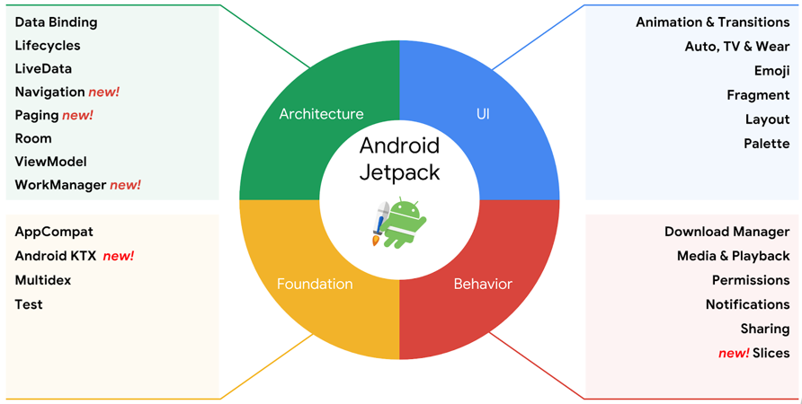
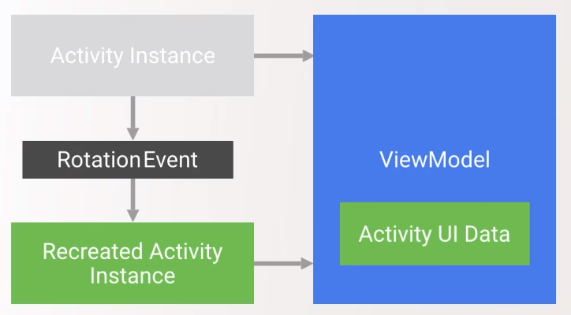

# Jetpack

## Introduction & history

For almost a decade, Android developers have been trying to figure out how to architect their applications. MVC, MVP, MVVM, MVI, Clean Architecture, Flux, Redux, RxJava... You've probably heard it all if you listen to conference talks regularly. Buzzwords and concepts are plenty, and they (probably) all had applications built on them that worked well enough.

At the 2017 I/O conference, Google themselves finally took a stance on architecture, publishing their initial batch of architecture components as well as their "opinionated guide on app architecture" alongside them.

This year, at I/O '18, Google expanded on this by rebranding both the architecture components and some of the existing support libraries as *Jetpack*. Jetpack isn't just a collection of libraries, however, it also includes the guidance and tooling they provide in addition to these libraries. It also some includes libraries that were newly released in 2018, such as Paging, WorkManager, or Navigation.

Here's an overview of everything that's grouped under the Jetpack brand as of now:



Later on, we'll be building on some of the pieces of this huge puzzle, namely, some of the architecture components. By now you might be already familiar with them, but let's take a look at these now.

## ViewModel

Storing UI state has long been an issue on Android. We have to handle configuration changes (usually simplified to orientation changes, but we know there's more to it fthan that) by using `savedInstanceState` to save and then restore data in our `Activity`. This is tedious code to write, can only be done with primitives and serializable objects, has a size limit, and it's yet another thing that's very strongly coupled to our `Activity` instances.

This is what the `ViewModel` component aims to solve: it lets us store UI data in a lifecycle-aware way, yet nicely decoupled from our `Activity`. We can fetch `ViewModel` instances in our `Activity` (or `Fragment`, but I'll be sticking to `Activity` while explaining things here), and if we ask for the `ViewModel` again after a configuration change, we'll get *the same `ViewModel` instance* we had before.



This way, any data we store in the `ViewModel` will be available after the configuration change, and we can display it in our `Activity` again. `ViewModel` implementations are arbitrary classes (other than their mandatory superclass), and they can store any type of data as properties - no limitation to serializables.

Here's what the basic usage of `ViewModel` might look like:

```kotlin
class UserViewModel : ViewModel() {
    val user = User(name ="Sally", age = 25)
}
	
class UserActivity : AppCompatActivity() {
    override fun onCreate(savedInstanceState: Bundle?) {
        super.onCreate(savedInstanceState)
        val userViewModel = ViewModelProviders.of(this).get(UserViewModel::class.java)
    }
}
```

When fetching our `ViewModel`, we use the `ViewModelProviders` class, and we have to provide it with our `Activity` instance as well as the `Class` of the `ViewModel` we'd like it to instantiate. This call will return a brand new instance if our `Activity` has just started, or an existing one if we're making the call after a configuration change.

### Some important notes about using `ViewModel`

Never store references to UI elements or the `Activity` inside `ViewModel`. It has a longer lifespan than these things, and would therefore cause serious memory leaks.

Keep in mind that ot can't replace `savedInstanceState` entirely. While it can store arbitrary data, and any amount of it (barring the memory limits of your app's VM), it essentially does this in a static way, and therefore it doesn't survive process death on low memory.
    
> Recommendation: use it to store all data you need to populate your UI here. For example, this might be a user's name, address, their profile picture as a bitmap, etc.

On the other hand, `savedInstanceState` is written to disk even when the application is killed by the system, so it's the only way to restore state after a low memory event.

> Recommendation: use it to store the minimal necessary amount of data you need to repopulate the `ViewModel`, for example, just the user's ID.

### ViewModel Factory

The `ViewModel` example above is not a realistic implementation - it holds a constant value, but in reality, we'd like to fetch data from a data source of some sorts. To do this, we'd need to access a repository or at least a `Context` in our `ViewModel`.

As a first step, we can add the required parameter to our `ViewModel`'s constructor, and use it to fetch our data:

```
class UserViewModel : ViewModel(private val context: Context) {
    val user = UserRepository(context).getUser()
}
```

However, if we do this, the previous call we made to `ViewModelProviders` will now fail with an exception at runtime, because it can no longer instantiate a `UserViewModel` on its own - it doesn't know where to get a `Context` from.

The way to tell the provider how to create a `ViewModel` with parameters is by giving it a [`ViewModelProvider.Factory`](https://developer.android.com/reference/android/arch/lifecycle/ViewModelProvider.Factory) implementation it can call when the `ViewModel` needs to be created. We can write one for our `UserViewModel` like this:

```kotlin
class UserViewModelFactory(private val context: Context) : ViewModelProvider.Factory {

    override fun <T : ViewModel?> create(modelClass: Class<T>): T {
        return UserViewModel(context) as T
    }

}
```

The `create` method has to return a generic value, since the `Factory` could theoretically be asked to create an instance of any `ViewModel` subclass, but as long as we only ask this specific `Factory` to provide us `UserViewModel` instances, the cast we perform in it to `T` is safe.

Finally, we modify the call to `ViewModelProviders`, passing in an instance of our `Factory`:

```kotlin
val factory = UserViewModelFactory(applicationContext)
val viewModel = ViewModelProviders.of(this, factory).get(UserViewModel::class.java)
```

Note that we used the `applicationContext` as the parameter instead of passing in our `Activity` using `this`. We have to do this because the reference to this `Context` will be stored in the `ViewModel` later, and we don't want to leak our `Activity`.

## LiveData

*`LiveData` is a lifecycle-aware, observable data holder.* This sentence both sounds great and accurately describes what `LiveData` does - but let's look at it in detail, step by step.

### An observable data holder

`LiveData` wraps a single value (of any type, as it's generic), and it implements the [observer pattern](https://en.wikipedia.org/wiki/Observer_pattern). Its clients (the observers) can observe the `LiveData` instance, and every time the value contained by the `LiveData` changes, they'll be notified of the change, and receive the new value.

One of the usual places to make use of this is in - guess what - `ViewModel`s. Instead of placing a simple value in the `ViewModel`, we can wrap it in a `LiveData` instead, which the `Activity` can then observe:

```kotlin
class UserViewModel : ViewModel() {
    val user: LiveData<User> = ...
}

class UserActivity : AppCompatActivity() {
    override fun onCreate(savedInstanceState: Bundle?) {
        super.onCreate(savedInstanceState)
        val userViewModel = ViewModelProviders.of(this).get(UserViewModel::class.java)
        userViewModel.user.observe(this, Observer { user ->
            // show user on UI
        })
    }
}
```

This is a way of sending data from the `ViewModel` to the `Activity` without holding a direct reference to it.

### Lifecycle awareness

Of course, there's still a reference somewhere in here from the `LiveData` instance to the `Observer`, and from there to the `Activity`, otherwise new values placed in the `LiveData` couldn't be propagated to the UI. 

However, `LiveData` is lifecycle aware. For every observer we register to it, we need to pass in an associated [`LifecycleOwner`](https://developer.android.com/reference/android/arch/lifecycle/LifecycleOwner) (something with a lifecycle). In our example, this was the `Activity` itself. Through this interface, `LiveData` is able to track the `Activity`'s lifecycle changes, and offer some very convenient features.

The most important perhaps is that it automatically removes `Observer` instances from itself whose lifecycle has ended. We don't have to keep a reference to our `Observer` in our `Activity`, and we can't forget to remove it in `onDestroy`. It's done for us automatically, both simplifying the API and preventing any memory leaks we might have otherwise introduced.

By tracking the lifecycle, `LiveData` also makes sure that only "active" `Observer`s are notified of changes. If the value it holds is updated and the `Activity` the `Observer` belongs to is in the background, it won't send it an update until it's visible again. Furthermore, if the value changes multiple times while the `Observer` isn't active, it will only receive the latest value once it becomes active again.

Finally, `LiveData` observers are always notified on the UI thread, so we can immediately modify UI in the `Observer` without having to worry about threading on this end.

### Creating and updating `LiveData`

We've seen how to observe `LiveData` instances, now let's take a look at the other side of using it: creating instances and setting the value it holds.

[`LiveData`](https://developer.android.com/reference/android/arch/lifecycle/LiveData) is actually just an interface, so we can't instantiate it directly. We do get a simple concrete implementation of it however, [`MutableLiveData`](https://developer.android.com/reference/android/arch/lifecycle/MutableLiveData):

```kotlin
val user: MutableLiveData<User> = MutableLiveData<User>()
```

If we're on the UI thread, we can update the stored value by calling the `setValue` method (or in Kotlin, setting the `value` property):

```kotlin
user.setValue(User("Ann", 34))
user.value = User("Jim", 41)
```

We can also set the value from a background thread without having to get back to the UI thread ourselves, by using the `postValue` method:

```kotlin
user.postValue(User("Zoe", 22))
```

The usual way to use `LiveData` in a `ViewModel` is to have a public property with the type `LiveData` that the `Activity` can observe but not modify, while storing the actual implementation in a [backing property](https://kotlinlang.org/docs/reference/properties.html#backing-properties) which has the `MutableLiveData` type so that we can set and modify its value from within the `ViewModel`:

```kotlin
class UserViewModel : ViewModel() {
    private val _user = MutableLiveData<User>()
    val user: LiveData<User> = _user
    
    fun initUser() {
        _user.value = User("Michael", 54)
    }
}
```

## Continue...

[With this done, let's get back to coroutines and talk about Coroutine scopes.](./coroutine-scopes.md)
