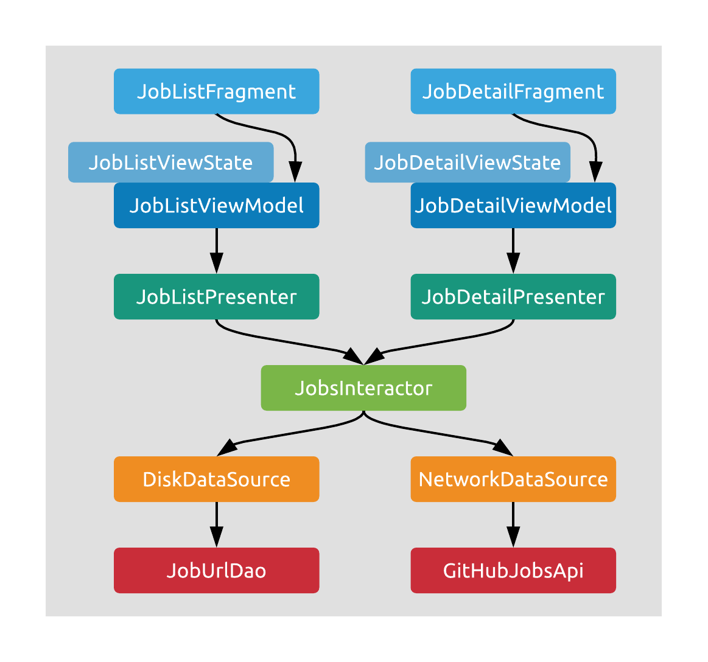

# Layers

A good architecture has some layers. And this one has many. Sometimes more than you'd like it to - so perhaps change it when you start using it for your own projects. But here's the ones we use and what they do.

## Fragments

Fragments will represent application screens. They observe immutable state from their respective ViewModels and display it on the UI. They also forward input events to the ViewModel, and may receive state updates or one-time events in return.

## ViewModels

ViewModels store the current state of the UI in a LiveData, handle UI related logic, and update the state based on task results. They start coroutines (in the UI context) for every task they receive (in the form of input events), and forward calls to their presenters.

## Presenters

Presenters put work on background threads, and then use Interactors (one or more) to access business logic. Then, they transform the results to screen-specific presentation models for the ViewModels to use. They can create these screen specific models because there's a Presenter for each screen.

## Interactors

Interactors contain the core business logic of the application. They have access to Data sources that they use to aggregate and manipulate data and perform computations. They are not tied to a single screen, but instead group functionality by the major features of the application.

## Data sources

Data sources provide the interactors with data from various origins - local database and file system, network locations, key-value stores, system APIs, resources, etc. It's their responsibility to keep their stored data in a consistent state (i.e. not expose operations that can lead to inconsistency).

## Continue...

[Next, we'll look at these layers with coloured glasses.](./threading.md)
