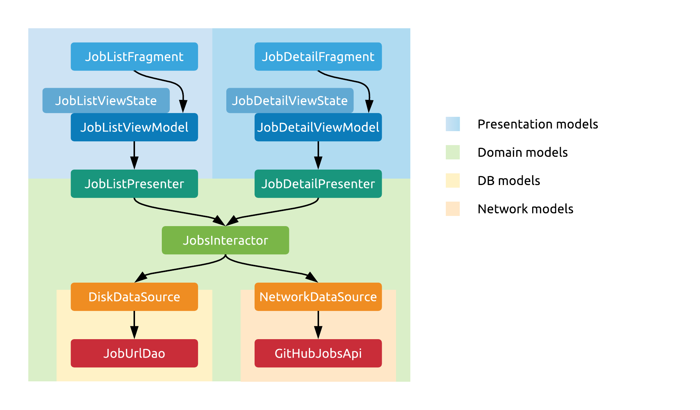

# Models

Up next are some very controversial design choices. This is where I usually expect the lose some of the people who have been nodding along with me so far. The architecture has _a lot_ of mapping between different model objects. Let's look at this visually first:

 

## Domain models

Let's start from the middle. Our business logic will be performed by Interactors, and they'll perform this using domain models. These are pure Kotlin data classes for the most part, preferably with all immutable properties. Going both upward and downwards from this layer, we'll be mapping to other models, and here's why.

## Data models

Data sources will get their own model objects to use internally. Their interfaces towards Interactors won't expose these models, only domain models and primitives, but they'll map to and from their own data models internally. These might be similar to our domain models most of the time, but often they'll have the data in a different format, or for example, be annotated with various library specific annotations (`@Entity`, `@SerializedName`), or inherit from library specific base classes. Having separate models here ensures that our business logic dosen't depend on these libraries.

## Presentation models

In the other direction, we have Presenters. These will map the domain models to screen specific presentation models. Why are these necessary then? Again, this isn't just mapping for the sake of mapping. The reasoning here is that domain models might be in different formats, and there might not even be a 1-to-1 mapping between these and the models would be easy to present.

Enter Presentation models - these should be in a format that is readily displayable on the UI, without any more formatting or data processing required. Essentially, we want all of our UI manipulation code to be as simple as this:

```kotlin
authorNameText.text = viewState.author.name
```

Finally, why do we do this in the Presenter? For one, they're screen specific, and we definitely need different presentation models per screen, as there's little chance that two screens display the exact same set of data in the exact same format. Plus, as we've seen before, the Presenters' methods all run on the IO threadpool, so we aren't blocking the UI thread when we're looping through lists and mapping these models.

## References

For more about this topic, read [this excellent article by Joe Birch](https://overflow.buffer.com/2017/12/21/even-map-though-data-model-mapping-android-apps/).

## Continue...

[Back to the main page to check out our example app.](../../README.md#the-example-application)
