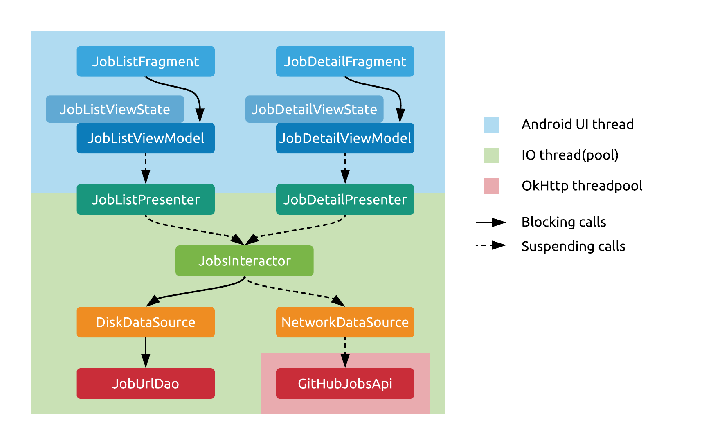

# Threading

At this point, you know we'll be using coroutines as our threading solution. But how exactly are we going to do that?

As mentioned before, ViewModels are going to start coroutines when Fragments call them. They'll start these in the UI context (i.e. on the UI thread), so that they can easily set the state in the `LiveData` they'll be storing.

As soon as these calls hit the Presenter layer, they'll be moved to the IO context, so everything below this point will run on a background threadpool. This means that in the lower layers we may perform blocking calls freely, because they'll just block one of these background threads.

One approach may be to make all calls from the Presenter down blocking, and this is the easiest thing to do. Just write non-suspending functions in the Interactors and in the Data sources - this shouldn't be hard, as most APIs are blocking by default. If you do this, you'll only be taking advantage of coroutines to easily hop between the UI and IO threads. 

But if you want, you can propagate the suspending nature of these calls down into the lower layers. You just need to mark the functions along the way with the `suspend` keyword. If you do this, the lower layers will be aware that they are running inside coroutines. What are the benefits of this?

- You can support cancellation better. If all calls are blocking in the lower layers, cancelling the coroutine will only cut off execution when your calls return to the suspending parts of your code, the blocking parts will always be all executed.
- You'll be free to easily switch the thread your code is executing on. For example, you might have a data source which wants to have its own single thread wrapped in a `CoroutineContext`. If its interface has all suspending functions, it can move all calls it receives to that single thread very easily.
- You might use advanced coroutine features in lower layers to implement either business logic or data sources. 

In our example app, we'll make all of our single Interactor's methods suspending. The Interactor will make use of two Data sources, one that stores data on disk, and another that accesses the network.

Our `DiskDataSource` will have a regular, blocking interface and perform its operations in a blocking manner on the IO thread that it's called from.

The `NetworkDataSource`, on the other hand, will have suspending methods. It will be implemented using Retrofit and a special [call adapter](https://github.com/JakeWharton/retrofit2-kotlin-coroutines-adapter) that provides coroutine support. This lets us make our calls in a suspending way.

- The network call still has to block a thread, but this won't be the UI thread, nor one of our IO threads. The API will suspend the coroutine on the IO thread we called it from and execute network calls on the default OkHttp threadpool ()which would've been used if we had a callback-based Retrofit API implementation).
- The adapter supports cancellation as well. If the coroutine is cancelled from the ViewModel, this cancellation will immediately run down the suspending call chain, and cancel the network call directly and immediately. This means that if we leave a screen while a long network call is ongoing, the call won't be completed in the background with its result thrown away, like with many other threading solutions - your own apps might be implemented this way.

## Continue...

[There's yet another way to look at these layers.](./models.md)
