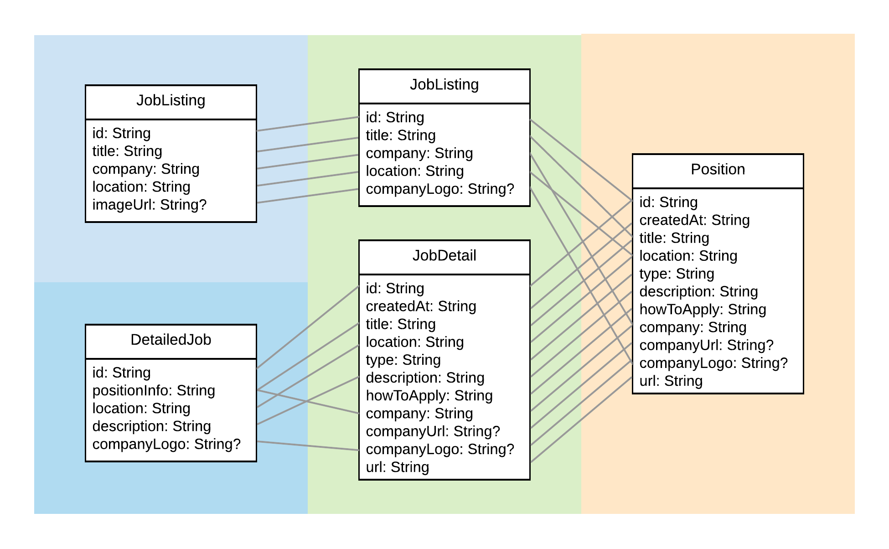

# Data and models

## Models

Here's a look at all the model objects in our application.



For this example, we have the same model object returned by the API we're querying whether we ask for a list of jobs or a single one, this is the `Position` model.

In our domain layer, we'll have separate entities for listings and details, just to show how this might be done. You can see that these are very straightforward to map to from the `Position` model.

Finally, in our presentation layer we have separate models per screen, already containing formatted, ready-to-display information. For example, the `positionInfo` property of a `DetailedJob` is a combination of the `title` and `company` name found in `JobDetail`. 

## Interacting

We've already seen how our UI is implemented, as well as our `JobListPresenter`. Let's see where the data comes from by looking at the lower layers now.

Presenters depend on Interactors, ours is called `JobInteractor`. It depends on a `NetworkDataSource`, and for almost all of its methods, just calls the appropriate method on this data source (for now).

We can see a small bit of business logic being performed here: before returning either `JobListing` or `JobDetails` objects, the Interactor makes sure that the image URLs they contain are prefixed with `"https"` and not `"http"`.

```kotlin
class JobsInteractor @Inject constructor(
        private val networkDataSource: NetworkDataSource
) {

    private fun String?.toHttpsUrl(): String? = this?.replaceFirst("http", "https")

    suspend fun getAllJobListings(): List<JobListing> {
        return networkDataSource.getAllJobListings().map {
            it.copy(companyLogo = it.companyLogo.toHttpsUrl())
        }
    }
    
}
```

Notice the extension function being defined on the nullable `String?` type so it can be called safely even if a job happens to contain no company image URL. The `copy` method generated for data classes also comes in handy here, as it lets us change a single property in the models that we are otherwise just passing along.

## Source of all data (for now)

`NetworkDataSource` is a simple class. Its responsibility is to call into whatever API implementation we have, map the results of the calls to domain objects, and return those.

```kotlin
class NetworkDataSource @Inject constructor(
        private val api: GitHubJobsApi
) {

    suspend fun getAllJobListings(): List<JobListing> {
        return api.getPositions()
                .await()
                .map {
                    JobListing(
                            id = it.id,
                            title = it.title,
                            company = it.company,
                            location = it.location,
                            companyLogo = it.companyLogo
                    )
                }
    }

}
```

Again, like in the Presenter, this sort of mapping can be made easy to read by using named parameters when creating model objects.

The methods in `NetworkDataSource` are still suspending methods - we've carried the notion that we're inside a coroutine along with us all the way from the UI layer. 

This enables quite a few handy things. For example, inside our `NetworkDataSource` we could still call `withContext` if we didn't want to perform our network calls on the IO threadpool, but instead we had our own internal `Context` to work in, perhaps backed by a single thread so that all network calls are forced to be sequential. 

This isn't quite the approach we chose here, but we do use different threads than the IO pool for our network calls. Our calls into `GitHubJobsApi` return `Deferred` instances, which you can think of as the coroutine version of `Completable`, `Promise`, or `Future`, whichever you're familiar with. By calling `await` on this `Deferred` we suspend the current thread until the result is available, so while the network call is being executed, we don't even block a thread in our IO pool.

How did we implement such a convenient networking API?

## The API

Why, with Retrofit, of course.

```kotlin
interface GitHubJobsApi {

    @GET("/positions.json")
    fun getPositions(
            @Query("search") searchTerm: String? = null,
            @Query("location") location: String? = null,
            @Query("markdown") markdown: Boolean = true,
            @Query("full_time") fullTime: String? = null
    ): Deferred<List<Position>>

    @GET("/positions/{positionId}.json")
    fun getPositionById(
            @Path("positionId") positionId: String
    ): Deferred<Position>

}
```

Our API is a standard Retrofit interface, only instead of using callbacks or returning `Call` instances, we make it return the `Deferred` we want to use.

This is enabled by Retrofit's support for _call adapters_. The one we're using here is [retrofit2-kotlin-coroutines-adapter](https://github.com/JakeWharton/retrofit2-kotlin-coroutines-adapter) by Jake Wharton (which will [soon be merged into Retrofit as well](https://github.com/square/retrofit/pull/2886)). You can find the code that sets it up inside `NetworkModule`:

```kotlin
@Provides
fun provideRetrofit(okHttpClient: OkHttpClient): Retrofit {
    return Retrofit.Builder()
            .client(okHttpClient)
            .baseUrl(GITHUB_JOBS_API_URL)
            .addConverterFactory(GsonConverterFactory.create())
            .addCallAdapterFactory(CoroutineCallAdapterFactory())
            .build()
}
```

(Extra explanation: okay, so network calls don't block the IO thread we were running our coroutine on from the Presenter down, but where do they run then? The call adapter just uses Retrofit callbacks in its implementation, which are executed on a threadpool maintained internally by OkHttp. This is where the calls are while our coroutine is suspended in the IO context.)

## Continue...

[`GOTO main`](../../README.md#implementation)
