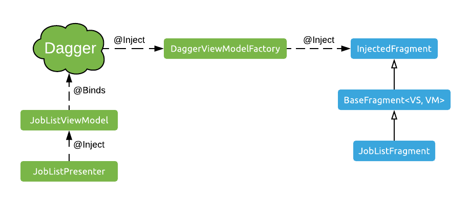

# Dagger Factory details

The mechanism we're using to implement our Dagger-powered `ViewModelProvider.Factory` is called *multibindings*. If you need to catch up, you can read about bindings and multibindings [here](https://proandroiddev.com/dagger-2-annotations-binds-contributesandroidinjector-a09e6a57758f) and [here](https://google.github.io/dagger/multibindings.html), for example. 

Using these mechanisms, we construct a map in our `ViewModelModule`. The keys in the map are the `Class` values of each `ViewModel` (e.g. `JobListViewModel::class`). The values in these map are the `ViewModel` types themselves (e.g. `JobListViewModel`). 

This may seem redundant, but keep in mind that the keys we label our dependencies with could be other types as well, for example `String` or `Int`. We're only using `Class` as the key because that's what the `ViewModelProvider.Factory` implementation will receive as a parameter when it has to instantiate a ViewModel.

This will essentially let us ask Dagger at any time to create a ViewModel of a given `Class`, the key we bound it with in this module:

```kotlin
@Module
abstract class ViewModelModule {

    @Binds
    @Singleton
    abstract fun bindViewModelFactory(daggerViewModelFactory: DaggerViewModelFactory): ViewModelProvider.Factory
    
    @Binds
    @IntoMap
    @ViewModelKey(ProfileViewModel::class)
    abstract fun bindProfileViewModel(profileViewModel: ProfileViewModel): ViewModel
    
}
```

We've also bound the `DaggerViewModelFactory` we're implementing, so that we can inject the map we've constructed above into it with Dagger. 

We could simply ask for a `Map<Class<ViewModel>, ViewModel>` in the `Factory`, but then we'd only get one concrete instance of `ViewModel` for each key (essentially, for each screen). If we opened the same screen multiple times, they'd have to have the same state because they'd receive the same `ViewModel` instances. This makes no sense.

Instead, we'll ask for the `Provider<ViewModel>` type as the map's values. A `Provider` is a class we can keep calling `get()` on, and each time it will manufacture new `ViewModel` instances, which will have all of its dependencies injected by Dagger appropriately.

This brings us to this implementation for our `ViewModelProvider.Factory`:
  
```kotlin
class DaggerViewModelFactory @Inject constructor(
        private val creators: Map<Class<ViewModel>, Provider<ViewModel>>
) : ViewModelProvider.Factory {

    override fun <T : ViewModel> create(modelClass: Class<T>): T {
        return creators[modelClass].get() as T
    }

}
``` 

Let's review one more time:

- It receives a `Map` in its constructor from Dagger, which is backed by Dagger's injection mechanism to create any `ViewModel` that's been bound with its own `Class` as the key.
- Whenever we invoke `ViewModelProviders` and pass this `Factory` to it, it'll call the `Factory` with the concrete `ViewModel` `Class` we need to create.
- This `Factory` will fetch the appropriate `Provider` from the `Map` it stores in its `creators` property, and create the required type of `ViewModel` by calling the `Provider`'s `get` method. This `ViewModel` will receive its dependencies via constructor injection, because it's instantiated by Dagger. 

And the illustration of how these components are connected, again:



## Notes and references

The code for `DaggerViewModelFactory` here is sample code that doesn't even quite compile, but I hope it gets the idea across. There's a couple more little things you need to take care of for this implementation to work in terms of generics, Kotlin-Java interop, and null handling. If you want to see the real, complete implementation, look at the `DaggerViewModelFactory` class in the project.
 
This implementation is originally from a Google sample project, specifically, from their [GitHub Browser Sample](https://github.com/googlesamples/android-architecture-components/blob/17c315a050745c61ae8e79000bc0251305bd148b/GithubBrowserSample/app/src/main/java/com/android/example/github/viewmodel/GithubViewModelFactory.kt) app.

## Continue

[We're already in deep, let's go deeper.](./reified-viewmodel.md)
