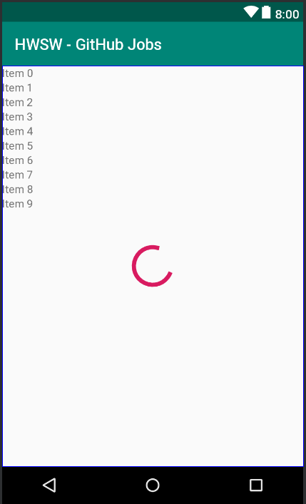
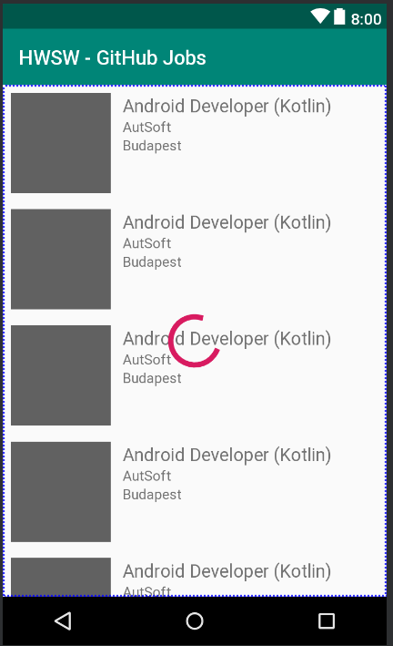
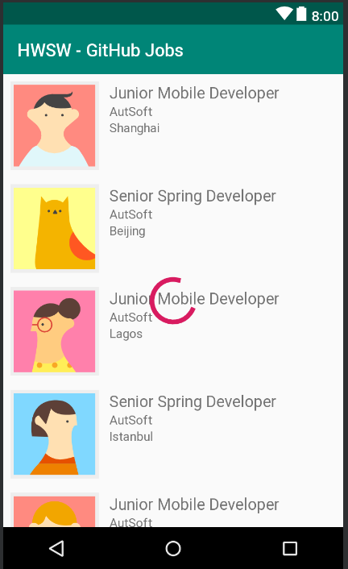

# Layout preview improvements, sample data

Android Studio has some great tooling support for previewing layouts, but sometimes we need to provide it with some extra help to really make good use of it.

If we take a look at the preview it generates for `fragment_job_list.xml` right now, we'll see that it only displays our `RecyclerView` as a couple simple lines of text.



We can provide the information about which layout we'll use in our rows by adding the `tools:listitem` attribute to the `RecyclerView`, like this:

```xml
<android.support.v7.widget.RecyclerView
    android:id="@+id/jobListings"
    android:layout_width="0dp"
    android:layout_height="0dp"
    android:orientation="vertical"
    app:layoutManager="android.support.v7.widget.LinearLayoutManager"
    app:layout_constraintBottom_toBottomOf="parent"
    app:layout_constraintEnd_toEndOf="parent"
    app:layout_constraintStart_toStartOf="parent"
    app:layout_constraintTop_toTopOf="parent"
    tools:listitem="@layout/row_job_listing" />
``` 



This is much better, but we can do even more by editing the `row_job_listing.xml` layout as well. In there, we can use built-in sample data to populate avatars as well as locations in our rows (only in the layout previews, not at runtime!). 

To our `ImageView`, we can add the following attribute:

```xml
tools:src="@tools:sample/avatars"
```

And to the `TextView` displaying location information (`locationText`), this one:

```xml
tools:text="@tools:sample/cities"
```

There are a number of sample data sets available, which you can find quite easily by just browsing them in code completion while adding the attributes above. We can find names, zip codes, lorem ipsum text, and more.

What we can't find, however, are good job titles. We'll have to provide these ourselves, and the tooling thankfully lets us do this as well.

Let's right click on the `app` module in the Project view, and choose `New -> Sample Data Directory`. This will create a directory called `sampledata` within `app`. Create a file within this directory called `jobtitles`. In each line of the file, add a job title, for example:

```text
Junior Mobile Developer
Senior Spring Developer
```

We can use this the same way as the sample data from before, the only difference being one less `tools:` prefix. Set the following attribute on the `TextView` with the ID `titleText`:

```xml
tools:text="@sample/jobtitles"
```

You should now have this preview for your list screen, populated with all this great looking sample data:



## Continue...

[More layout related tooling just ahead.](./layout-refactoring.md)
